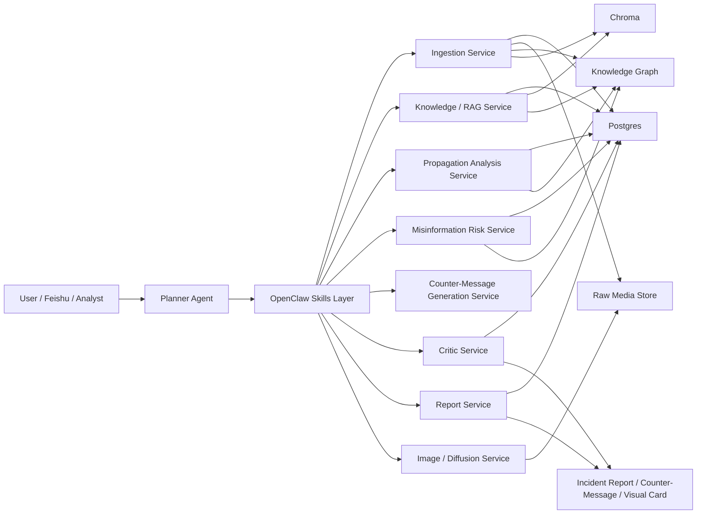
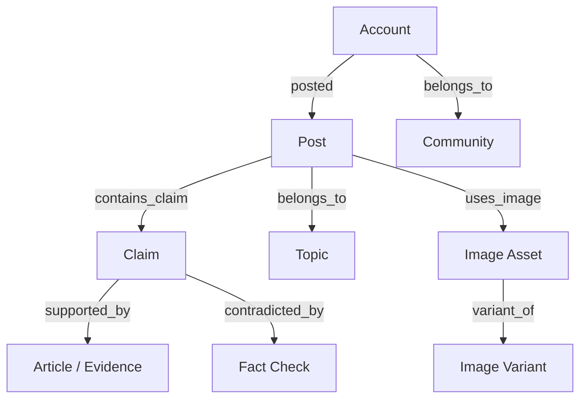
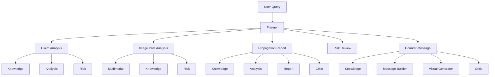

# OpenClaw Society Project Plan

## 1. Project Positioning

### Proposed Title

**OpenClaw Multimodal Social Media Propagation Analysis and Counter-Messaging System**

### One-Sentence Goal

Build a multi-agent system that ingests social-media-style text and image posts, tracks the spread of claims and topics, assesses misinformation and influence risk, and produces evidence-backed reports plus counter-messaging content.

### Why This Fits "Society"

This project aligns with the course's Society direction because it focuses on:

- information dissemination in context
- social-media-scale topic and claim tracking
- misinformation and persuasive messaging detection
- social and community-level propagation analysis
- counter-messaging and intervention support

This is closer to the lecture definition of Society than a financial research workflow.

### Platform and Language Scope

- **Target Platform**: X (Twitter/X) — primary data source via X API v2
- **Primary Language**: English (US-focused project)
- **Implication**: All OCR, embedding, claim normalization, and counter-messaging components are configured for English-first operation.

## 2. Problem Definition

The system should answer questions such as:

- Is a specific claim currently spreading across a set of social posts?
- What evidence supports or contradicts that claim?
- Is the propagation pattern suspicious, misleading, or coordinated?
- What concise counter-message should be published?
- Can the system generate a visual clarification card for that counter-message?

## 3. Design Principles

### Architecture Principles

- Reuse the current OpenClaw multi-agent architecture instead of rebuilding from scratch.
- Keep deterministic execution in services.
- Use skills as the standard tool-calling contract.
- Use planner as the orchestration and routing layer.
- Use hard orchestration for the main workflow and soft agentic reasoning inside bounded steps.

### Safety Principles

- No strong conclusion without evidence.
- Conflicting evidence must be disclosed.
- High-risk or low-evidence outputs must require human review.
- Generated counter-messaging must pass critic review before release.

## 4. High-Level Architecture

## 5. Component Mapping

The current project can be reused, but several modules must change their business meaning.

| Current Module | New Role in Society Project | Change Level |
|---|---|---|
| `planner` | orchestration, intent routing, workflow control | low |
| `rag` / `knowledge` | retrieval of posts, claims, articles, fact-check evidence | low |
| `report` | incident brief, propagation report, response summary | low |
| `critic` | evidence sufficiency, overclaim detection, output review | low |
| `ingestion` | social posts, images, articles, fact-check data ingestion | high |
| `quant` | replaced by propagation analysis | high |
| `risk` | replaced by misinformation / influence risk review | medium |
| graph layer | from stock/filing graph to claim/post/account/topic graph | medium |

## 6. Core Agents and Responsibilities

### Planner

- classify user intent
- select the workflow
- trigger skills in the correct order
- aggregate outputs into the final response

### Knowledge

- retrieve relevant posts, articles, fact checks, and prior reports
- build evidence packs
- normalize claim wording
- group evidence by support / contradiction / uncertainty
- resolve claim identity via two-stage deduplication:
  1. **Stage 1 — Embedding similarity** (fast filter): compute cosine similarity against existing claims in Chroma; score ≥ 0.92 → candidate match; score < 0.85 → new claim
  2. **Stage 2 — LLM judgment** (precision check): submit candidate pair to LLM for semantic equivalence decision; output `SAME` / `RELATED` / `DIFFERENT`
     - `SAME` → merge nodes, increment propagation count
     - `RELATED` → add `related_to` edge, keep separate nodes
     - `DIFFERENT` → insert as new claim node

### Analysis

- compute propagation signals
- summarize topic growth or decline
- detect repetition, stance imbalance, and anomaly hints
- produce structured propagation summaries

### Risk

- evaluate misinformation likelihood
- flag weak evidence or suspicious propagation
- assess whether human review is required

### Report

- generate incident summaries
- create propagation analysis reports
- generate counter-message drafts

### Critic

- check unsupported claims
- check contradiction handling
- check overstatement and false certainty
- approve or reject counter-message outputs

### Visual Generator

- generate a visual clarification card via Stable Diffusion (local deployment)
- create social-media-ready counter-message images (X post format: 1200×675 px)
- text overlay rendered via Pillow to ensure English typography quality
- operate only after Critic review passes gating (hard dependency)

## 7. Multimodal Handling

Image posts should be treated as first-class evidence objects.

### Technology Choices

| Function | Tool | Rationale |
|---|---|---|
| OCR + Image Captioning | Claude Vision (`claude-sonnet-4-6`) | Single API call handles both OCR and captioning; strong English performance |
| Image Embedding | `text-embedding-3-small` (OpenAI) | Supports cross-modal text-image retrieval; cost-efficient |
| Visual Card Generation | Stable Diffusion (local deployment) | Offline operation, no third-party dependency for output assets |

### Image Post Pipeline

1. ingest image and post metadata from X API v2
2. call Claude Vision API → extract OCR text + image caption in a single request
3. extract candidate claims from merged text via LLM
4. generate image embedding via `text-embedding-3-small`
5. merge `post_text + ocr_text + image_caption`
6. index the merged evidence in Chroma (vector) and knowledge graph

### Image Understanding Outputs

- `ocr_text`: text extracted from the image
- `image_caption`: natural language description of image content
- `candidate_claims`: list of factual claims inferred from the post
- `image_type`: category label (e.g., screenshot, chart, meme, photo)
- `embedding_id`: reference to Chroma vector entry

### Visual Card Generation (Stable Diffusion)

- Triggered only after Critic review passes
- Input: structured counter-message text → prompt template → Stable Diffusion
- Output: PNG image sized for X post format (1200×675)
- Text overlay rendered via Pillow (to avoid SD font rendering issues in English)

## 8. Data Model

### Postgres

Store structured operational data:

- posts
- images
- articles
- claims
- reports
- run logs

### Chroma

Store semantic retrieval vectors for:

- post text
- OCR text
- image captions
- article chunks
- fact-check chunks

### Knowledge Graph

**Technology: Kuzu** (embedded graph database, zero-deployment, Cypher-compatible)

Rationale: runs in-process with the Python application; no separate service required; supports Cypher query syntax; suitable for MVP scale (up to tens of millions of nodes).

#### Node Types

- `post`
- `image_asset`
- `claim`
- `topic`
- `account`
- `community`
- `article`
- `fact_check`

#### Relations

- `account -> posted -> post`
- `post -> contains_claim -> claim`
- `post -> belongs_to_topic -> topic`
- `post -> uses_image -> image_asset`
- `claim -> supported_by -> article`
- `claim -> contradicted_by -> fact_check`
- `account -> belongs_to -> community`
- `image_asset -> variant_of -> image_asset`
- `claim -> same_as -> claim` (semantically equivalent, different wording)
- `claim -> related_to -> claim` (related but not equivalent)

## 9. Intent Routing

The planner should route requests into a small, controlled set of task types.

### Intent Types

- `CLAIM_ANALYSIS`
- `IMAGE_POST_ANALYSIS`
- `PROPAGATION_REPORT`
- `MISINFO_RISK_REVIEW`
- `COUNTER_MESSAGE`

### Example Routing

## 10. Skills and Tool Calling

Tool calling should be implemented through **skills**, not ad hoc prompt instructions.

### Why Skills

- stable input/output contract
- reusable across workspaces
- easier error handling
- better fit with OpenClaw-native architecture

### Proposed Skills

- `x-post-ingest` — fetch posts from X API v2, normalize to internal format
- `image-post-ingest` — OCR + image captioning + embedding via Claude Vision; wraps the full multimodal ingestion pipeline
- `claim-retrieve` — vector + graph retrieval of related claims, articles, fact checks
- `propagation-analyze` — compute trend metrics, stance distribution, anomaly signals
- `misinfo-risk-review` — score misinformation likelihood, flag for human review if needed
- `counter-message-build` — generate evidence-backed rebuttal text
- `counter-visual-generate` — generate clarification card via Stable Diffusion + Pillow text overlay
- `campaign-report-build` — compile full incident report
- `critic-review` — validate evidence coverage, detect overclaims, approve or reject output

### Responsibility Split

- **Planner** decides which workflow to run.
- **Skills** define how tools are called.
- **Services** execute deterministic logic.

## 11. Workflow Strategy

The workflow should be **hard-orchestrated at the top level** and **soft-agentic inside bounded stages**.

### Hard-Orchestrated

These steps should be fixed:

- intent routing
- skill sequence
- risk gate
- critic gate
- report schema
- visual generation trigger

### Soft-Agentic

These steps can be flexible:

- query rewriting
- evidence grouping
- claim normalization
- response wording
- visual prompt drafting

This keeps the system explainable and testable while retaining some agentic flexibility.

### Error and Fallback Handling

All failures must be explicitly logged and surfaced in the final report. Silent failure is not permitted.

| Failure Scenario | Handling |
|---|---|
| OCR returns empty or low confidence | Degrade: proceed with `post_text` only; flag `image_text_unavailable` in report |
| No relevant evidence retrieved | Block: set risk to `INSUFFICIENT_EVIDENCE`; route to human review; do not generate counter-message |
| Critic rejects after 2 retries | Block: send to human review queue with rejection log; halt automated output |
| Stable Diffusion generation fails | Degrade: return text counter-message only; flag `visual_card_unavailable` in report |
| Kuzu graph query timeout | Degrade: skip graph-based analysis; use vector retrieval results only; flag `graph_unavailable` |
| X API rate limit hit | Queue: defer ingestion job; retry with exponential backoff; do not drop posts |

## 12. Example End-to-End Flow

### Use Case

User asks:

> Analyze whether this image post is misleading and generate a clarification card.

### System Flow

1. `planner` classifies `IMAGE_POST_ANALYSIS + COUNTER_MESSAGE`
2. `image-post-ingest` extracts OCR text, image caption, and candidate claims via Claude Vision
3. `claim-retrieve` gathers related evidence and fact checks
4. `propagation-analyze` summarizes topic spread
5. `misinfo-risk-review` assigns a risk level
6. `counter-message-build` creates rebuttal text
7. `critic-review` checks evidence sufficiency and wording accuracy
   - Pass → continue to step 8
   - Reject → return to step 6 for revision, max 2 retries; if still rejected → route to human review queue
8. `counter-visual-generate` creates a visual clarification card via Stable Diffusion (triggered only after Critic passes)
9. `report` returns the final analyst-facing output

## 13. MVP Scope

To keep the project manageable, the first version should only do:

- **Data ingestion**: X API v2 (filtered stream or search endpoint); MVP may use a pre-collected JSON dataset of X posts to avoid API quota issues during development
- text + image post ingestion (English posts only)
- OCR + image summary via Claude Vision
- claim retrieval via Chroma + Kuzu
- propagation summary
- misinformation risk review
- counter-message text
- one visual clarification card via Stable Diffusion

Do **not** start with:

- full graph-scale community detection
- deepfake detection
- large-scale influence optimization
- real-world automatic campaign execution

## 14. Proposed Roadmap

### Phase 1: Domain Shift

- replace finance-specific semantics with social-media semantics
- rename `quant` to `analysis`
- redefine `risk` as misinformation risk
- update docs, schemas, and tests

### Phase 2: Multimodal Evidence

- add OCR
- add image summary and embeddings
- support image posts in retrieval and graph indexing

### Phase 3: Propagation Analysis

- add trend metrics
- add stance and anomaly summaries
- add graph-backed claim/topic views

### Phase 4: Counter-Messaging

- generate rebuttal text
- add visual card generation
- critic gate all final outputs

## 15. Evaluation

Recommended evaluation dimensions:

| Dimension | Measurement Method | Target |
|---|---|---|
| **Retrieval relevance** | NDCG@5 on 50 annotated queries vs. BM25 baseline | > BM25 baseline |
| **Critic catch rate** | Inject 100 overclaim outputs; measure correct rejection rate | ≥ 85% |
| **Counter-message usefulness** | 3-reviewer blind scoring (1–5): factual accuracy, readability, rebuttal strength | Average ≥ 3.5 |
| Evidence coverage | % of retrieved evidence items that are directly cited in report | ≥ 70% |
| Contradiction disclosure rate | % of conflicting evidence pairs that are surfaced to analyst | ≥ 80% |
| Propagation summary quality | Human rating of trend description accuracy (1–5) | Average ≥ 3.5 |
| Misinformation risk calibration | Precision/recall on a labeled test set of 200 posts | F1 ≥ 0.75 |
| Multimodal grounding quality | % of image-derived claims traceable to OCR or caption text | ≥ 75% |

## 16. Final Recommendation

If the project must align with the course's **Society** direction, this is the most defensible path:

- keep the current OpenClaw multi-agent architecture
- replace the financial application layer with a social-media propagation layer
- strengthen the system with multimodal understanding
- use a knowledge graph as the core relational memory
- use diffusion or image generation only for counter-messaging, not as the primary analysis engine

This keeps the project technically coherent and much closer to the lecture definition of Society.
